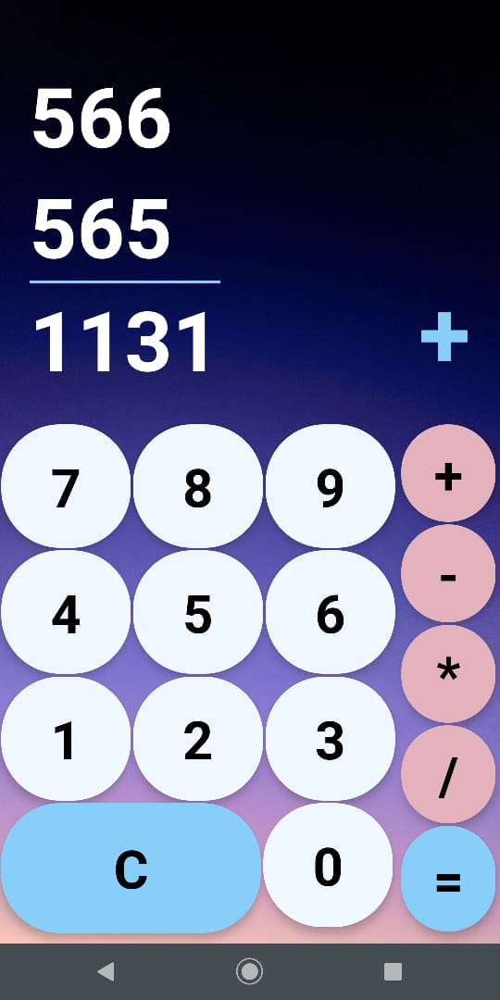

# React Native calculator App

This is a sample calculator app built with React Native for sole purposes of learning the ReactNative framework and practice different methods on building a mobile app.

You can run this in expo!

link:

<a href="https://exp.host/@adivianahd/calculator-app">Link here to run expo!</a>